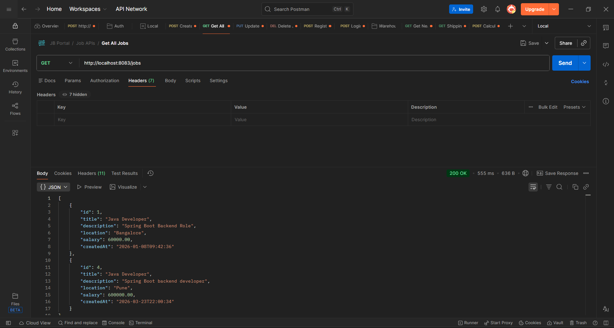
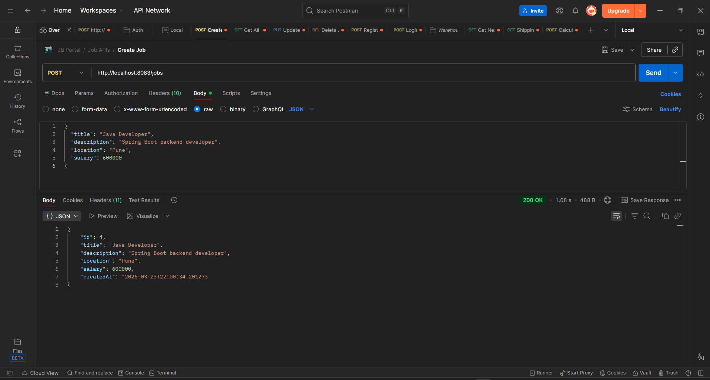
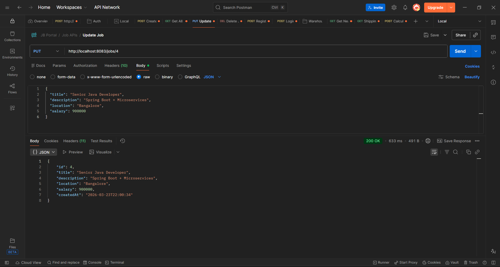
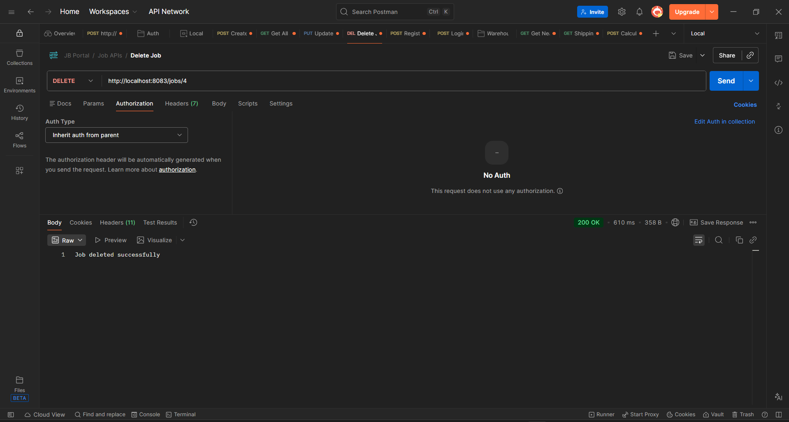

# Job Portal Application

## 🚀 Features
- User Registration & Login with secure authentication
- Job Posting (Create, Update, Delete, View)
- RESTful APIs for all operations
- Password encryption using Spring Security (BCrypt)
- Global Exception Handling

## 🛠 Tech Stack
- Java
- Spring Boot
- MySQL
- REST APIs
- Docker
- Postman

## 📌 API Endpoints
- Create Job
- Update Job
- Delete Job
- Get All Jobs

## 📷 Screenshots

## ▶️ How to Run
1. Clone the repository
2. Open in IntelliJ IDEA
3. Configure MySQL in application.properties
4. Run the Spring Boot application
