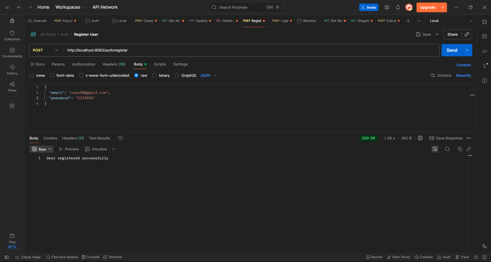
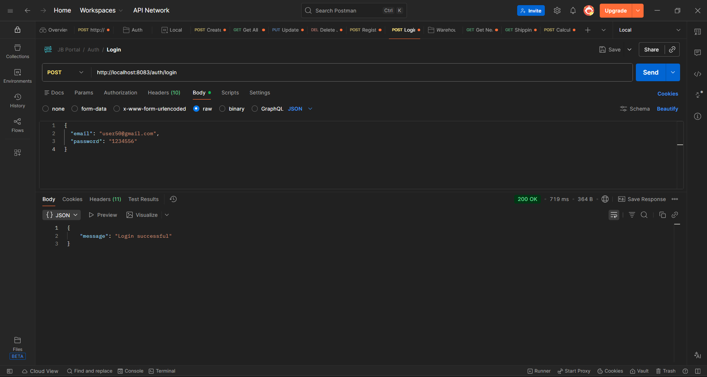
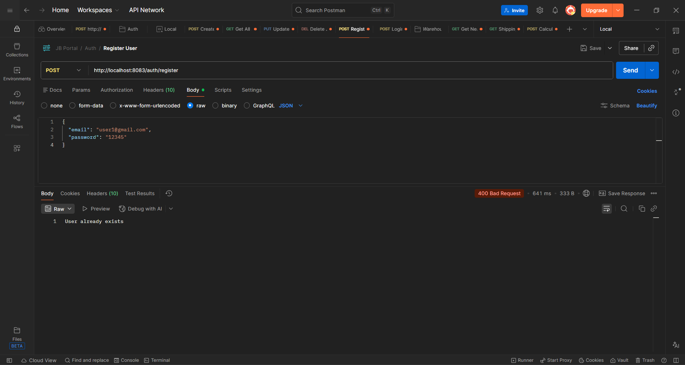

# 🚀 Online Job Portal API (Spring Boot | MySQL | Docker)

🔗 Live API: Coming Soon (Currently runs on localhost:8083)  
📂 GitHub Repo: https://github.com/aishwaryabehare1504/jbportal  

---

## 📋 Project Overview

A backend-based Job Portal application that provides REST APIs for managing job listings and user authentication.

💡 Demonstrates backend development, REST API design, database integration, and Spring Security.

### It allows:
- Users to register and login securely  
- Create, update, delete, and view jobs  
- Secure password handling using BCrypt  

---

## 🏗️ Architecture

### 🔹 Core Components

**1. Controller Layer**
- `JobController.java`  
- `AuthController.java`  

**2. Service Layer**
- `JobService.java`  
- `UserService.java`  

**3. Repository Layer**
- `JobRepository.java`  
- `UserRepository.java`  

**4. Model Layer**
- `Job.java`  
- `User.java`  

**5. Security**
- `SecurityConfig.java`  
- BCrypt encryption  

**6. DTOs**
- `LoginRequest.java`  
- `LoginResponse.java`  

---

## 🚀 Features

- User Registration & Login  
- Password encryption (BCrypt)  
- CRUD operations for jobs  
- RESTful API design  
- MySQL integration  
- Docker support  

---

## 📸 API Screenshots

### 🔹 Create Job


### 🔹 Get Jobs


### 🔹 Update Job


### 🔹 Delete Job


### 🔹 Register


### 🔹 Login


### 🔹 Exception Handling - Duplicate User Registration


---

## 📁 Project Structure

```
com.jobportal
│
├── config
│   └── SecurityConfig.java
│
├── controller
│   ├── JobController.java
│   └── AuthController.java
│
├── model
│   ├── Job.java
│   └── User.java
│
├── repository
│   ├── JobRepository.java
│   └── UserRepository.java
│
├── service
│   ├── JobService.java
│   └── UserService.java
│
└── payload
    ├── LoginRequest.java
    └── LoginResponse.java
```

---

## ⚙️ Tech Stack

- Spring Boot  
- Java  
- MySQL  
- Spring Data JPA  
- Spring Security  
- Maven  
- Docker  

---

## 🔧 Configuration

```
DB_URL=your_database_url
DB_USER=your_username
DB_PASSWORD=your_password
```

---

## 🐳 Docker Setup

```
docker build -t job-portal .
docker run -p 8083:8083 job-portal
```

---

## 🚀 API Endpoints

### 🔐 Auth APIs
- POST `/auth/register`  
- POST `/auth/login`  

### 💼 Job APIs
- POST `/jobs`  
- GET `/jobs`  
- PUT `/jobs/{id}`  
- DELETE `/jobs/{id}`  

---

## 💡 Sample Requests

### Register
```json
{
  "email": "test@gmail.com",
  "password": "123456"
}
```

### Login
```json
{
  "email": "test@gmail.com",
  "password": "123456"
}
```

### Create Job
```json
{
  "title": "Java Developer",
  "description": "Spring Boot Backend Role",
  "location": "Bangalore",
  "salary": 60000
}
```

---

## 🔒 Security

- BCrypt password encryption  
- Input validation  
- No hardcoded credentials  

---

## 🚨 Challenges

- Layered architecture understanding  
- Spring Security configuration  
- Environment setup  
- API debugging  

---

## 📈 Future Enhancements

- JWT Authentication  
- Role-based access  
- Pagination & filtering  
- Frontend integration  
- Deployment  
- Resume upload feature  

---

## 🤝 Contributing

📌 This project is built for learning and demonstration purposes.

Currently, contributions are not open. However, suggestions, feedback, and improvements are always welcome.

If you’d like to contribute in the future, feel free to fork the repository and create a pull request.

---

## 📄 License

This project is for learning and demonstration purposes only.

---

## 🔗 Connect

GitHub: https://github.com/aishwaryabehare1504/jbportal  
LinkedIn: https://www.linkedin.com/in/aishwarya-behare-45191b307/  

---

## ❤️ Built With

Java + Spring Boot + MySQL + Docker
